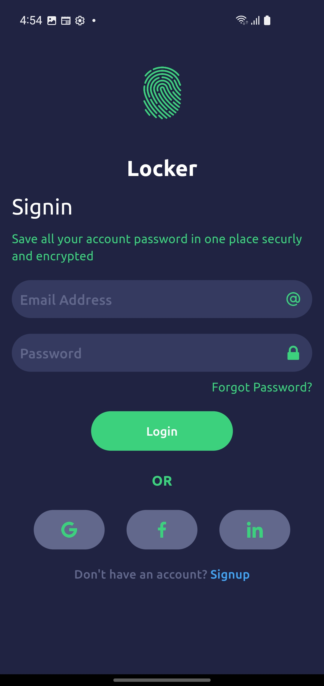
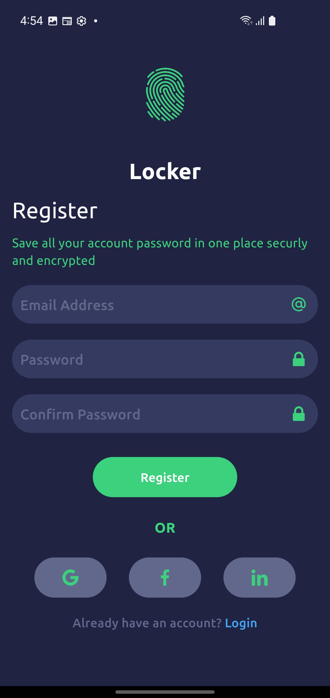

# Pass Locker 🔒

Welcome to **Pass Locker**, your secure and stylish password manager UI built with Flutter! 🚀

## 📱 Screenshots

Here are some snapshots of Pass Locker in action:

<p align="center">
  
  
  
</p>

## 🎨 Features

- **Beautiful UI**: A clean and modern design to keep your passwords safe and easily accessible.
- **Responsive Layout**: Optimized for both mobile and tablet devices.
- **Easy Navigation**: Intuitive and user-friendly interface.

## 🚀 Getting Started

To get started with Pass Locker, follow these steps:

1. **Clone the repository**

   ```sh
   git clone https://github.com/yourusername/pass-locker.git
   ```

2. **Navigate to the project directory**

   ```sh
   cd pass-locker
   ```

3. **Install dependencies**

   ```sh
   flutter pub get
   ```

4. **Run the app**
   ```sh
   flutter run
   ```

## 📬 Contact

If you have any questions or suggestions, feel free to reach out:

- **Email**: ashahid.dev@gmail.com
- **GitHub**: [iabdullahshahid](https://github.com/iabdullahshahid)

---

Made with ❤️ by Abdullah Shahid
